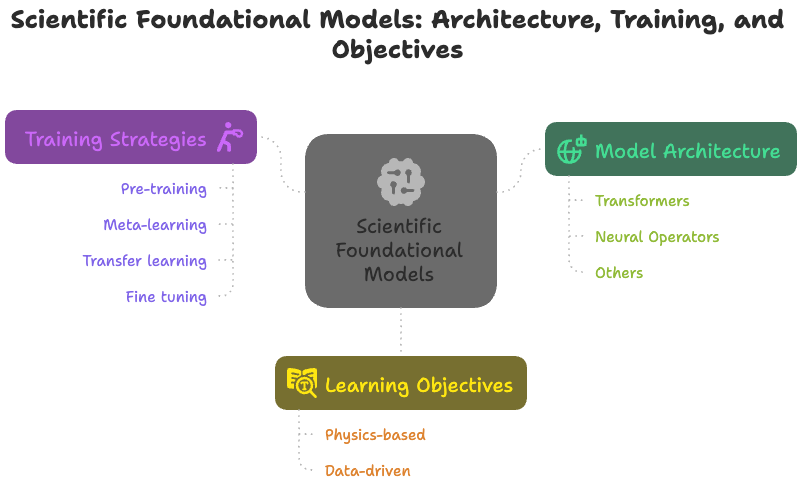

Citation: 

Menon, Sidharth S. and Mondal, Trishit and Brahmachary, Shuvayan and Panda, Aniruddha and Joshi, Subodh M. and Kalyanaraman, Kaushic and Jagtap, Ameya D., On Scientific Foundation Models:Rigorous Definitions, Key Applications, and a Survey. Available at SSRN: https://ssrn.com/abstract=5409063 or http://dx.doi.org/10.2139/ssrn.5409063

# Scientific Foundation Models (SciFM) — Curated Papers 

 <!--PAPERS_COUNT-->55<!--/PAPERS_COUNT-->

This list tracks research on **scientific foundation models** — large, reusable models pre-trained on scientific data (text, code, signals, fields, etc.) that can be adapted to many downstream scientific tasks.

## Domains
- [Geophysics (6)](#geophysics)
- [Biology (4)](#biology)
- [Biomedical Imaging (1)](#biomedical-imaging)
- [Chaotic Dynamics (3)](#chaotic-dynamics)
- [Chemistry (7)](#chemistry)
- [Climate Science (4)](#climate-science)
- [Differential Equations (9)](#differential-equations)
- [Earth Observation (6)](#earth-observation)
- [Fluid dynamics (1)](#fluid-dynamics)
- [Fluid Dynamics (3)](#fluid-dynamics)
- [Material Science (7)](#material-science)
- [Nuclear Science (1)](#nuclear-science)
- [Robotics (3)](#robotics)

> Grouped by domain

## Geophysics

| Title | Venue/Year | Authors | Links |
|---|---|---|---|
| [Light-weighted foundation model for seismic data processing based on representative and non-redundant pre-training dataset](https://arxiv.org/abs/2503.10092) | arXiv preprint arXiv:2503.10092 2025 | Dong, Xintong, Yu, Wenshuo, Lin, Jun, Guo, Zhenbo, Wang, Hongzhou, Yang, Jianhao | [Link](https://arxiv.org/abs/2503.10092) |
| [K2: A foundation language model for geoscience knowledge understanding and utilization](https://arxiv.org/abs/2306.05064) | Proceedings of the 17th ACM International Conference on Web Search and Data Mining 2024 | Deng, Cheng, Zhang, Tianhang, He, Zhongmou, Chen, Qiyuan, Shi, Yuanyuan, Xu, Yi, Fu, Luoyi, Zhang, Weinan et al. | [Link](https://arxiv.org/abs/2306.05064) |
| [SeisCLIP: A seismology foundation model pre-trained by multimodal data for multipurpose seismic feature extraction](https://arxiv.org/abs/2309.02320) | IEEE Transactions on Geoscience and Remote Sensing 2024 | Si, Xu, Wu, Xinming, Sheng, Hanlin, Zhu, Jun, Li, Zefeng | [Link](https://arxiv.org/abs/2309.02320) |
| [SeisLM: a Foundation Model for Seismic Waveforms](https://arxiv.org/abs/2410.15765) | arXiv preprint arXiv:2410.15765 2024 | Liu, Tianlin, M\"unchmeyer, Jannes, Laurenti, Laura, Marone, Chris, de Hoop, Maarten V, Dokmanic, Ivan | [Link](https://arxiv.org/abs/2410.15765) |
| [SeisT: A foundational deep learning model for earthquake monitoring tasks](https://arxiv.org/abs/2310.01037) | IEEE Transactions on Geoscience and Remote Sensing 2024 | Li, Sen, Yang, Xu, Cao, Anye, Wang, Changbin, Liu, Yaoqi, Liu, Yapeng, Niu, Qiang | [Link](https://arxiv.org/abs/2310.01037) |
| [Seismic Foundation Model (SFM): A new generation deep learning model in geophysics. ArXiv](https://arxiv.org/abs/2309.02791) | arXiv preprint arXiv:2309.02791 2023 | Sheng, H, Wu, X, Si, X, Li, J, Zhang, S, Duan, X | [Link](https://arxiv.org/abs/2309.02791) |

---

## Biology

| Title | Venue/Year | Authors | Links |
|---|---|---|---|
| [A foundation model for clinician-centered drug repurposing](https://pubmed.ncbi.nlm.nih.gov/39322717/) | Nature Medicine 2024 | Huang, Kexin, Chandak, Payal, Wang, Qianwen, Havaldar, Shreyas, Vaid, Akhil, Leskovec, Jure, Nadkarni, Girish N, Glicksberg, Benjamin S et al. | [Link](https://pubmed.ncbi.nlm.nih.gov/39322717/) |
| [Large scale foundation model on single-cell transcriptomics. bioRxiv](https://www.biorxiv.org/content/10.1101/2023.05.29.542705v2) | 2023 | Hao, Minsheng, Gong, Jing, Zeng, Xin, Liu, Chiming, Guo, Yucheng, Cheng, Xingyi, Wang, Taifeng, Ma, Jianzhu et al. | [Link](https://www.biorxiv.org/content/10.1101/2023.05.29.542705v2) |
| [MolE: a molecular foundation model for drug discovery](https://arxiv.org/abs/2211.02657) | arXiv preprint arXiv:2211.02657 2022 | Mendez-Lucio, Oscar, Nicolaou, Christos, Earnshaw, Berton | [Link](https://arxiv.org/abs/2211.02657) |
| [scBERT as a large-scale pretrained deep language model for cell type annotation of single-cell RNA-seq data](https://www.biorxiv.org/content/10.1101/2021.12.05.471261v3.full) | Nature Machine Intelligence 2022 | Yang, Fan, Wang, Wenchuan, Wang, Fang, Fang, Yuan, Tang, Duyu, Huang, Junzhou, Lu, Hui, Yao, Jianhua | [Link](https://www.biorxiv.org/content/10.1101/2021.12.05.471261v3.full) |

---

## Biomedical Imaging

| Title | Venue/Year | Authors | Links |
|---|---|---|---|
| [Dino-Reg: Efficient Multimodal Image Registration with Distilled Features](https://pubmed.ncbi.nlm.nih.gov/40327463/) | IEEE Transactions on Medical Imaging 2025 | Song, Xinrui, Xu, Xuanang, Zhang, Jiajin, Reyes, Diego Machado, Yan, Pingkun | [Link](https://pubmed.ncbi.nlm.nih.gov/40327463/) |

---

## Chaotic Dynamics

| Title | Venue/Year | Authors | Links |
|---|---|---|---|
| [Panda: A pretrained forecast model for universal representation of chaotic dynamics](https://arxiv.org/abs/2505.13755) | arXiv preprint arXiv:2505.13755 2025 | Lai, Jeffrey, Bao, Anthony, Gilpin, William | [Link](https://arxiv.org/abs/2505.13755) |
| [Prose: Predicting multiple operators and symbolic expressions using multimodal transformers](https://arxiv.org/abs/2309.16816) | Neural Networks 2024 | Liu, Yuxuan, Zhang, Zecheng, Schaeffer, Hayden | [PDF](https://arxiv.org/pdf/2309.16816) · [Link](https://arxiv.org/abs/2309.16816) |
| [Zero-shot forecasting of chaotic systems](https://arxiv.org/abs/2409.15771) | arXiv preprint arXiv:2409.15771 2024 | Zhang, Yuanzhao, Gilpin, William | [Link](https://arxiv.org/abs/2409.15771) |

---

## Chemistry

| Title | Venue/Year | Authors | Links |
|---|---|---|---|
| [A Mamba-based foundation model for materials](https://www.nature.com/articles/s44387-025-00009-7.epdf?sharing_token=FU3FMSRqmRuLwNuVPQyTa9RgN0jAjWel9jnR3ZoTv0PS2hfnjuuLSMn-0qA8NAhd8D6PlKhYvKnJA7188AIuUxKcADwU1t1spWsFtlVyI-tOOOEjunBmuLO20RTH4gAy3kJieQYMLV2Y6Pvdi85azXLu0fAz6MgIhtKr3Wr2sH8%3D) | npj Artificial Intelligence 2025 | Soares, Eduardo, Vital Brazil, Emilio, Shirasuna, Victor, Zubarev, Dmitry, Cerqueira, Renato, Schmidt, Kristin | [Link](https://www.nature.com/articles/s44387-025-00009-7.epdf?sharing_token=FU3FMSRqmRuLwNuVPQyTa9RgN0jAjWel9jnR3ZoTv0PS2hfnjuuLSMn-0qA8NAhd8D6PlKhYvKnJA7188AIuUxKcADwU1t1spWsFtlVyI-tOOOEjunBmuLO20RTH4gAy3kJieQYMLV2Y6Pvdi85azXLu0fAz6MgIhtKr3Wr2sH8%3D) |
| [MOL-Mamba: Enhancing Molecular Representation with Structural \& Electronic Insights](https://arxiv.org/abs/2412.16483) | Proceedings of the AAAI Conference on Artificial Intelligence 2025 | Hu, Jingjing, Guo, Dan, Si, Zhan, Liu, Deguang, Diao, Yunfeng, Zhang, Jing, Zhou, Jinxing, Wang, Meng | [PDF](https://arxiv.org/pdf/2412.16483) · [Link](https://arxiv.org/abs/2412.16483) |
| [Multi-view mixture-of-experts for predicting molecular properties using SMILES, SELFIES, and graph-based representations](https://openreview.net/abs/1f7179af049b59922ce925854b40854eeb553458.pdf) | Neurips 2024 Workshop Foundation Models for Science: Progress, Opportunities, and Challenges 2024 | Soares, Eduardo, Priyadarsini, Indra, Brazil, Emilio Vital, Shirasuna, Victor Yukio, Takeda, Seiji | [PDF](https://openreview.net/pdf/1f7179af049b59922ce925854b40854eeb553458.pdf) |
| [Mhg-gnn: Combination of molecular hypergraph grammar with graph neural network](https://arxiv.org/abs/2309.16374) | arXiv preprint arXiv:2309.16374 2023 | Kishimoto, Akihiro, Kajino, Hiroshi, Hirose, Masataka, Fuchiwaki, Junta, Priyadarsini, Indra, Hamada, Lisa, Shinohara, Hajime, Nakano, Daiju et al. | [PDF](https://arxiv.org/pdf/2309.16374) · [Link](https://arxiv.org/abs/2309.16374) |
| [Chemberta-2: Towards chemical foundation models](https://arxiv.org/abs/2209.01712) | arXiv preprint arXiv:2209.01712 2022 | Ahmad, Walid, Simon, Elana, Chithrananda, Seyone, Grand, Gabriel, Ramsundar, Bharath | [Link](https://arxiv.org/abs/2209.01712) |
| [ChemBERTa: large-scale self-supervised pretraining for molecular property prediction](https://arxiv.org/abs/2010.09885) | arXiv preprint arXiv:2010.09885 2020 | Chithrananda, Seyone, Grand, Gabriel, Ramsundar, Bharath | [Link](https://arxiv.org/abs/2010.09885) |
| [Dynamic Fusion for a Multimodal Foundation Model for Materials](https://openreview.net/pdf?id=wqWEUxEeNu) | AI for Accelerated Materials Design-ICLR 2025 | Priyadarsini, Indra, Takeda, Seiji, Hamada, Lisa | [Link](https://openreview.net/pdf?id=wqWEUxEeNu) |

---

## Climate Science

| Title | Venue/Year | Authors | Links |
|---|---|---|---|
| [ORBIT-2: Scaling Exascale Vision Foundation Models for Weather and Climate Downscaling](https://arxiv.org/abs/2505.04802) | arXiv preprint arXiv:2505.04802 2025 | Xiao Wang, Jong-Youl Choi, Takuya Kurihaya, Isaac Lyngaas, Hong-Jun Yoon, Xi Xiao, David Pugmire, Ming Fan, Nasik M. Nafi, Aristeidis Tsaris, Ashwin M. Aji, Maliha Hossain, Mohamed Wahib, Dali Wang, Peter Thornton, Prasanna Balaprakash, Moetasim Ashfaq, Dan Lu | [Link](https://arxiv.org/abs/2505.04802) |
| [Aurora: A foundation model of the atmosphere](https://arxiv.org/html/2405.13063v2) | AGU Fall Meeting Abstracts 2024 | Bodnar, Cristian | [Link](https://arxiv.org/html/2405.13063v2) |
| [Prithvi wxc: Foundation model for weather and climate](https://arxiv.org/abs/2409.13598) | arXiv preprint arXiv:2409.13598 2024 | Schmude, Johannes, Roy, Sujit, Trojak, Will, Jakubik, Johannes, Civitarese, Daniel Salles, Singh, Shraddha, Kuehnert, Julian, Ankur, Kumar et al. | [Link](https://arxiv.org/abs/2409.13598) |
| [Weathergfm: Learning a weather generalist foundation model via in-context learning](https://arxiv.org/abs/2411.05420) | arXiv preprint arXiv:2411.05420 2024 | Zhao, Xiangyu, Zhou, Zhiwang, Zhang, Wenlong, Liu, Yihao, Chen, Xiangyu, Gong, Junchao, Chen, Hao, Fei, Ben et al. | [PDF](https://arxiv.org/pdf/2411.05420) · [Link](https://arxiv.org/abs/2411.05420) |
| [Climax: A foundation model for weather and climate](https://arxiv.org/abs/2301.10343) | arXiv preprint arXiv:2301.10343 2023 | Nguyen, Tung, Brandstetter, Johannes, Kapoor, Ashish, Gupta, Jayesh K, Grover, Aditya | [Link](https://arxiv.org/abs/2301.10343) |

---

## Differential Equations

| Title | Venue/Year | Authors | Links |
|---|---|---|---|
| [A Multimodal PDE Foundation Model for Prediction and Scientific Text Descriptions](https://arxiv.org/abs/2502.06026) | arXiv preprint arXiv:2502.06026 2025 | Negrini, Elisa, Liu, Yuxuan, Yang, Liu, Osher, Stanley J, Schaeffer, Hayden | [PDF](https://arxiv.org/pdf/2502.06026) · [Link](https://arxiv.org/abs/2502.06026) |
| [Neuro-Symbolic AI for Analytical Solutions of Differential Equations](https://arxiv.org/abs/2502.01476) | arXiv preprint arXiv:2502.01476 2025 | Oikonomou, Orestis, Lingsch, Levi, Grund, Dana, Mishra, Siddhartha, Kissas, Georgios | [Link](https://arxiv.org/abs/2502.01476) |
| [PhysiX: A Foundation Model for Physics Simulations](https://arxiv.org/abs/2506.17774) | arXiv preprint arXiv:2506.17774 2025 | Nguyen, Tung, Koneru, Arsh, Li, Shufan, Grover, Aditya | [Link](https://arxiv.org/abs/2506.17774) |
| [Towards a foundation model for partial differential equations: Multioperator learning and extrapolation](https://arxiv.org/abs/2404.12355) | Physical Review E 2025 | Sun, Jingmin, Liu, Yuxuan, Zhang, Zecheng, Schaeffer, Hayden | [PDF](https://arxiv.org/pdf/2404.12355) · [Link](https://arxiv.org/abs/2404.12355) |
| [Towards a Foundation Model for Physics-Informed Neural Networks: Multi-PDE Learning with Active Sampling](https://arxiv.org/abs/2502.07425v1) | arXiv preprint arXiv:2502.07425 2025 | Park, Keon Vin | [PDF](https://arxiv.org/pdf/2502.07425v1) · [Link](https://arxiv.org/abs/2502.07425v1) |
| [Lemon: Learning to learn multi-operator networks](https://arxiv.org/abs/2408.16168) | arXiv preprint arXiv:2408.16168 2024 | Sun, Jingmin, Zhang, Zecheng, Schaeffer, Hayden | [Link](https://arxiv.org/abs/2408.16168) |
| [Poseidon: Efficient foundation models for pdes](https://arxiv.org/abs/2405.19101) | Advances in Neural Information Processing Systems 2024 | Herde, Maximilian, Raonic, Bogdan, Rohner, Tobias, K\"appeli, Roger, Molinaro, Roberto, de Bezenac, Emmanuel, Mishra, Siddhartha | [PDF](https://arxiv.org/pdf/2405.19101) · [Link](https://arxiv.org/abs/2405.19101) |
| [Ups: Efficiently building foundation models for pde solving via cross-modal adaptation](https://arxiv.org/abs/2403.07187) | arXiv preprint arXiv:2403.07187 2024 | Shen, Junhong, Marwah, Tanya, Talwalkar, Ameet | [PDF](https://arxiv.org/pdf/2403.07187) · [Link](https://arxiv.org/abs/2403.07187) |
| [In-context operator learning with data prompts for differential equation problems](https://arxiv.org/abs/2304.07993) | Proceedings of the National Academy of Sciences 2023 | Yang, Liu, Liu, Siting, Meng, Tingwei, Osher, Stanley J | [Link](https://arxiv.org/abs/2304.07993) |

---

## Earth Observation

| Title | Venue/Year | Authors | Links |
|---|---|---|---|
| [TerraMind: Large-Scale Generative Multimodality for Earth Observation](https://arxiv.org/abs/2504.11171) | arXiv preprint arXiv:2504.11171 2025 | Jakubik, Johannes, Yang, Felix, Blumenstiel, Benedikt, Scheurer, Erik, Sedona, Rocco, Maurogiovanni, Stefano, Bosmans, Jente, Dionelis, Nikolaos et al. | [Link](https://arxiv.org/abs/2504.11171) |
| [Neural plasticity-inspired multimodal foundation model for earth observation](https://arxiv.org/abs/2403.15356) | arXiv preprint arXiv:2403.15356 2024 | Xiong, Zhitong, Wang, Yi, Zhang, Fahong, Stewart, Adam J, Hanna, Jo\"elle, Borth, Damian, Papoutsis, Ioannis, Saux, Bertrand Le et al. | [Link](https://arxiv.org/abs/2403.15356) |
| [Prithvi-eo-2.0: A versatile multi-temporal foundation model for earth observation applications](https://arxiv.org/abs/2412.02732) | arXiv preprint arXiv:2412.02732 2024 | Szwarcman, Daniela, Roy, Sujit, Fraccaro, Paolo, G\islason, \THorsteinn El\i, Blumenstiel, Benedikt, Ghosal, Rinki, de Oliveira, Pedro Henrique, Almeida, Joao Lucas de Sousa et al. | [Link](https://arxiv.org/abs/2412.02732) |
| [Foundation models for generalist geospatial artificial intelligence](https://arxiv.org/abs/2310.18660) | arXiv preprint arXiv:2310.18660 2023 | Jakubik, Johannes, Roy, Sujit, Phillips, CE, Fraccaro, Paolo, Godwin, Denys, Zadrozny, Bianca, Szwarcman, Daniela, Gomes, Carlos et al. | [Link](https://arxiv.org/abs/2310.18660) |
| [GFM: Building geospatial foundation models via continual pretraining](https://arxiv.org/abs/2302.04476) | arXiv preprint arXiv:2302.04476 2023 | Mendieta, Mat\ias, Han, Boran, Shi, Xingjian, Zhu, Yi, Chen, Chen, Li, Mu | [Link](https://arxiv.org/abs/2302.04476) |
| [SpectralGPT: Spectral remote sensing foundation model](https://arxiv.org/abs/2311.07113) | arXiv preprint arXiv:2311.07113 2023 | Hong, Danfeng, Zhang, Bing, Li, Xuyang, Li, Yuxuan, Li, Chenyu, Yao, Jing, Yokoya, Naoto, Li, Hao et al. | [Link](https://arxiv.org/abs/2311.07113) |

---

## Fluid dynamics

| Title | Venue/Year | Authors | Links |
|---|---|---|---|
| [Multiple physics pretraining for spatiotemporal surrogate models](https://arxiv.org/abs/2310.02994) | Advances in Neural Information Processing Systems 2024 | McCabe, Michael, Regaldo-Saint Blancard, Bruno, Parker, Liam, Ohana, Ruben, Cranmer, Miles, Bietti, Alberto, Eickenberg, Michael, Golkar, Siavash et al. | [PDF](https://arxiv.org/pdf/2310.02994) · [Link](https://arxiv.org/abs/2310.02994) |

---

## Fluid Dynamics

| Title | Venue/Year | Authors | Links |
|---|---|---|---|
| [Prose-fd: A multimodal pde foundation model for learning multiple operators for forecasting fluid dynamics](https://arxiv.org/abs/2409.09811) | arXiv preprint arXiv:2409.09811 2024 | Liu, Yuxuan, Sun, Jingmin, He, Xinjie, Pinney, Griffin, Zhang, Zecheng, Schaeffer, Hayden | [PDF](https://arxiv.org/pdf/2409.09811) · [Link](https://arxiv.org/abs/2409.09811) |
| [Universal physics transformers: A framework for efficiently scaling neural operators](https://arxiv.org/abs/2402.12365) | Advances in Neural Information Processing Systems 2024 | Alkin, Benedikt, F\"urst, Andreas, Schmid, Simon, Gruber, Lukas, Holzleitner, Markus, Brandstetter, Johannes | [PDF](https://arxiv.org/pdf/2402.12365) · [Link](https://arxiv.org/abs/2402.12365) |
| [Vicon: Vision in-context operator networks for multi-physics fluid dynamics prediction](https://arxiv.org/abs/2411.16063) | arXiv preprint arXiv:2411.16063 2024 | Cao, Yadi, Liu, Yuxuan, Yang, Liu, Yu, Rose, Schaeffer, Hayden, Osher, Stanley | [Link](https://arxiv.org/abs/2411.16063) |

---

## Material Science

| Title | Venue/Year | Authors | Links |
|---|---|---|---|
| [A generative model for inorganic materials design](https://arxiv.org/abs/2312.03687) | Nature 2025 | Zeni, Claudio, Pinsler, Robert, Z\"ugner, Daniel, Fowler, Andrew, Horton, Matthew, Fu, Xiang, Wang, Zilong, Shysheya, Aliaksandra et al. | [Link](https://arxiv.org/abs/2312.03687) |
| [Multimodal foundation models for material property prediction and discovery](https://arxiv.org/abs/2312.00111) | Newton 2025 | Moro, Viggo, Loh, Charlotte, Dangovski, Rumen, Ghorashi, Ali, Ma, Andrew, Chen, Zhuo, Kim, Samuel, Lu, Peter Y et al. | [PDF](https://arxiv.org/pdf/2312.00111) · [Link](https://arxiv.org/abs/2312.00111) |
| [Multi-view mixture-of-experts for predicting molecular properties using SMILES, SELFIES, and graph-based representations](https://openreview.net/abs/1f7179af049b59922ce925854b40854eeb553458.pdf) | Neurips 2024 Workshop Foundation Models for Science: Progress, Opportunities, and Challenges 2024 | Soares, Eduardo, Priyadarsini, Indra, Brazil, Emilio Vital, Shirasuna, Victor Yukio, Takeda, Seiji | [PDF](https://openreview.net/pdf/1f7179af049b59922ce925854b40854eeb553458.pdf) |
| [Foundation model for material science](https://ojs.aaai.org/index.php/AAAI/article/view/26793) | Proceedings of the AAAI Conference on Artificial Intelligence 2023 | Takeda, Seiji, Kishimoto, Akihiro, Hamada, Lisa, Nakano, Daiju, Smith, John R | [Link](https://ojs.aaai.org/index.php/AAAI/article/view/26793) |
| [Mtencoder: A multi-task pretrained transformer encoder for materials representation learning](https://openreview.net/pdf?id=wug7i3O7y1) | AI for Accelerated Materials Design-NeurIPS 2023 Workshop 2023 | Prein, Thorben, Pan, Elton, Doerr, Tom, Olivetti, Elsa, Rupp, Jennifer LM | [Link](https://openreview.net/pdf?id=wug7i3O7y1) |
| [Scaling deep learning for materials discovery](https://pubmed.ncbi.nlm.nih.gov/38030720/) | Nature 2023 | Merchant, Amil, Batzner, Simon, Schoenholz, Samuel S, Aykol, Muratahan, Cheon, Gowoon, Cubuk, Ekin Dogus | [Link](https://pubmed.ncbi.nlm.nih.gov/38030720/) |
| [Large-scale chemical language representations capture molecular structure and properties](https://arxiv.org/abs/2106.09553) | Nature Machine Intelligence 2022 | Ross, Jerret, Belgodere, Brian, Chenthamarakshan, Vijil, Padhi, Inkit, Mroueh, Youssef, Das, Payel | [PDF](https://arxiv.org/pdf/2106.09553) · [Link](https://arxiv.org/abs/2106.09553) |

---

## Nuclear Science

| Title | Venue/Year | Authors | Links |
|---|---|---|---|
| [FM4NPP: A Scaling Foundation Model for Nuclear and Particle Physics](https://arxiv.org/abs/2508.14087) | arXiv preprint arXiv:2508.14087 2025 | David Park, Shuhang Li, Yi Huang, Xihaier Luo, Haiwang Yu, Yeonju Go, Christopher Pinkenburg, Yuewei Lin, Shinjae Yoo, Joseph Osborn, Jin Huang, Yihui Ren | [Link](https://arxiv.org/abs/2508.14087) |
| [Towards Foundation Models for Experimental Readout Systems Combining Discrete and Continuous Data](https://arxiv.org/abs/2505.08736) | arXiv preprint arXiv:2505.08736 2025 | J. Giroux and C. Fanelli | [Link](https://arxiv.org/abs/2505.08736) |
| [Exploring the Capabilities of the Frontier Large Language Models for Nuclear Energy Research](https://www.arxiv.org/abs/2506.19863) | arXiv preprint arXiv:2506.19863 2025 | Almeldein, Ahmed, Alnaggar, Mohammed, Archibald, Rick, Beck, Tom, Biswas, Arpan, Bostelmann, Rike, Brewer, Wes, Bryan, Chris et al. | [Link](https://www.arxiv.org/abs/2506.19863) |

---

## Robotics

| Title | Venue/Year | Authors | Links |
|---|---|---|---|
| [Gr00t n1: An open foundation model for generalist humanoid robots](https://arxiv.org/abs/2503.14734) | arXiv preprint arXiv:2503.14734 2025 | Bjorck, Johan, Casta\~neda, Fernando, Cherniadev, Nikita, Da, Xingye, Ding, Runyu, Fan, Linxi, Fang, Yu, Fox, Dieter et al. | [Link](https://arxiv.org/abs/2503.14734) |
| [On Foundation Models for Dynamical Systems from Purely Synthetic Data](https://arxiv.org/abs/2412.00395) | arXiv preprint arXiv:2412.00395 2024 | Ziegler, Martin, Posada-Moreno, Andres Felipe, Solowjow, Friedrich, Trimpe, Sebastian | [Link](https://arxiv.org/abs/2412.00395) |
| [Rt-1: Robotics transformer for real-world control at scale](https://arxiv.org/abs/2212.06817) | arXiv preprint arXiv:2212.06817 2022 | Brohan, Anthony, Brown, Noah, Carbajal, Justice, Chebotar, Yevgen, Dabis, Joseph, Finn, Chelsea, Gopalakrishnan, Keerthana, Hausman, Karol et al. | [Link](https://arxiv.org/abs/2212.06817) |

---

## Heliophysics

| Title | Venue/Year | Authors | Links |
|---|---|---|---|
| [Surya: Foundation Model for Heliophysics](https://arxiv.org/abs/2508.14112) | arXiv preprint arXiv:2508.14112 2025 | Sujit Roy, Johannes Schmude, Rohit Lal, Vishal Gaur, Marcus Freitag, Julian Kuehnert, Theodore van Kessel, Dinesha V. Hegde, Andrés Muñoz-Jaramillo, Johannes Jakubik et al. | [Link](https://arxiv.org/abs/2508.14112) |

---

